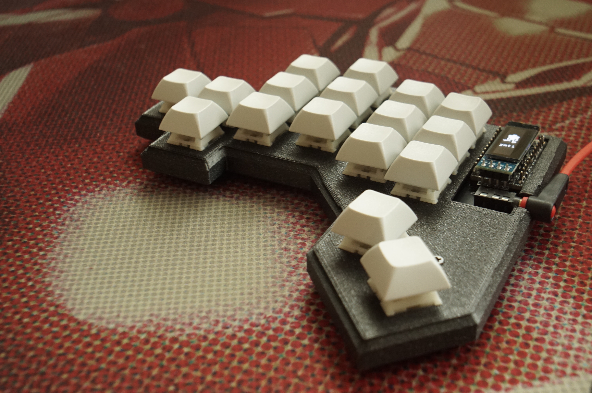

# Yeti 34 key split keyboard

## Who likes wrist pain anyway?

## Concepts
The main goals for this keyboard were:

- A split keyboard for bigger hands
- As little wrist movement as possible
- Natural hand position

### Features
- QMK support (hopefully)
- diodeless
- columnar stagger
- top pinky switch moved to the side for better reachability
- OLED support
- LEDs on the bottom

### Shopping list
This repository includes the pcb and a case design. To build a functioning
keyboard you will need other than that:

- 2x elite-c or similiar microcontrollers
- 2x TRRS PJ-320A connectors
- 34x cherry switches
- 2x OLEDs (optional)
- 12x WS2812b LEDs (optional)

### Map
Real life printable layout can be found in the main directory of this
repository named `layout.pdf`. It is suggested to first try the layout
and positioning of the keyboard to see if it's suitable for your hands before
doing any shopping. (The collectors are always welcome:)

### Pictures of the alpha version

